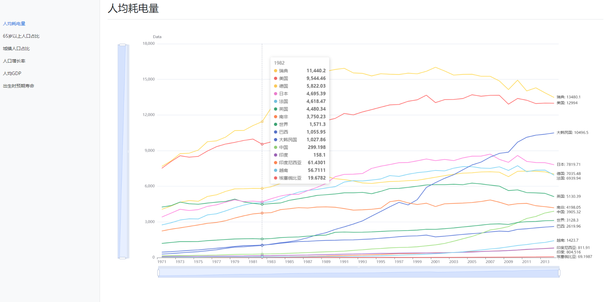
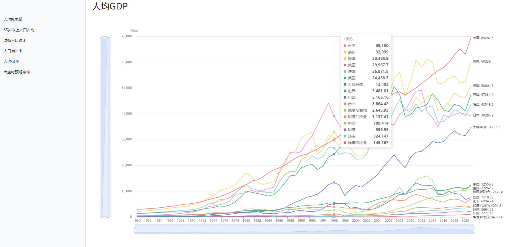
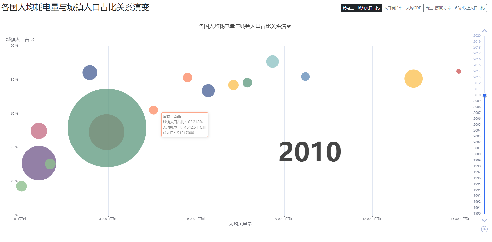

# visualization.github.io
可视化大作业
### 各国人均耗电量与城镇人口占比关系演变

> 项目成员：
>
> 宋璎航、皮亚杰、邓松林、施养权

#### 模板的使用说明

> * [echarts-动态排序折线图](https://echarts.apache.org/examples/zh/editor.html?c=line-race)
>
>   
>
> * [echarts-大数据量面积图](https://echarts.apache.org/examples/zh/editor.html?c=area-simple)
>
>   
>
> * [echarts-各国人均寿命与GDP关系演变](https://echarts.apache.org/examples/zh/editor.html?c=scatter-life-expectancy-timeline)
>
>   

在此基础上，我们做了以下工作：

1. 从世界银行的公开数据库中选取了6个我们感兴趣的数据集。

2. 结合前两个模板，实现了可变区间的折线图，方便用户观察多个相近的数据。

3. 以第三个模板为基础，实现了可变数据集的动态散点图。用户可以选择多个数据集中的任意两组，研究它们随时间变化的关系。

从上世纪60年代到现在，全球各个地区国家的人们平均生活质量都是由显著的提升的。我们组从统计的数据划分6个角度方面来分析各个数据可视化，和相互结合分析出各个的关系演变来实现对应可视化。

### 正文

本项目，使用交互式仪表盘对各国人均耗电量与城镇人口占比关系演变数据进行可视化，用户可以进行交互式探索获取更多信息。本项目可以用于清晰的看出近几十年的变化程度和单独某年的数据详情及其对应占比比例等信息。

##### 数据集：

如上面七个图片所展示的是我们使用的近几十年大部分地区国家的人均耗电量、65岁以上人口占比、城镇人口占比、人口增长率、人均GDP、出生时预期寿命的相应数据。

数据中包括国家（列A）、对应年份（行1）、具体数据（列B~）。

##### 项目框架：

本项目使用html+js+css+echarts实现，整体有两个部分的功能实现：

##### 可变区间折线图

可视化面板可以分为两个部分

- 左边部分显示表的是可以交互选择来将相对应的数据在右边部分显现出来。

- 右边部分由对应主题和相关数据的折线可视化，其中在折线末端可以看到现在的所对应的国家和详细的数据，也可以通过鼠标悬停放置来显示具体的年份和对应的数据。在左端和右端也有对应的drag tag功能。

- 如下图示

  

##### 动态散点图

这部分的可视化是选取的近30年，也就是1990-2020年的样本数据

- 右上角的横栏可以交互选择其中两个来使得更新对应的X、Y轴。右边的年份是自动增加的，也可以按下暂停或者拖动交互来对具体的某年分析。
- 可以通过对应的鼠标悬停来查看对应的地区国家的具体数据分析。

用户可以通过该功能自由地对任意两数据集之间的关系进行探索。

#### 总结

从交互式面板中，我们可以了解到数据内容集里的以下信息：

- 人均耗电量中印度地区很低，而美国瑞典几乎是其的十几倍。

- 在近几年日本的老龄化凸显得十分严重。

- 在近20里，我国的城镇发展进步非常大。

- 各国GDP与人均寿命呈明显的正相关关系。

- 各国65岁以上人口占比与人口出生率有着负相关关系。

- 人均GDP越高的国家，其城镇化率往往越高

  使用这个可视化面板，还可以对其他更具体的问题进行探索和分析处理。
